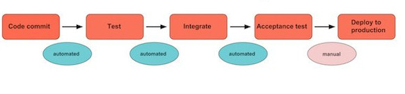

## Podstawy serwerów


---

#### Co oznaczają pojęcia serwer i klient?

* **Serwer** oznacza aplikcję dostarczającą daną funkcję (dane, strony, aplikacje) innym programom lub komputerom (*klientom*).
**Serwer** może oznaczać również maszynę (*fizyczną lub wirtualną*) na której uruchamiana jest aplikacja.

* **Klient** oznacza aplikację lub użytkownika korzystającego z usług świadczonych przez serwer.

---

Komunikacja pomiędzy klientem, a serwerem odbywa się poprzez odpowiedni dla danej usługi **protokół** komunikacyjny, najczęściej w modelu **request-response** lub **publisher-subscriber**.


---

##### Przykładowe funkcje oraZ protokoły serwerów

| Typ             | Zadanie                                   | Protokół               |
|-----------------|-------------------------------------------|------------------------|
| Serwer WWW      | Udostępnianie stron internetowych         | **HTTP** lub **HTTPS** |
| Serwer pocztowy | Udostępnia pliki i katalogi               | **SMTP** lub **SMTPS** |
| Serwer plików   | Udostępnia pliki i katalogi               | **FTP** lub **SFTP**   |
| Serwer drukarek | Udostępnia drukarki, kolejkuje wydruki    | **IPP** lub **IPPS**   |

---

#### Modele komunikacji i protokoły w aplikacjach przeglądarkowych

Protokół **HTTP(S)** działa w modelu **żądanie-odpowiedź** (*ang. request-response*). W takim modelu klient wysyła **żądanie** do serwera, a następnie oczekuje na **odpowiedź**. Jeżeli odpowiedź nie nastąpi w określonym czasie następuje **timeout**.

Serwer nie może samodzielnie nawiązać komunikacji z klientem. Oznacza to, że protokół pracuje w trybie **half-duplex**.


---

Aby umożliwić przesyłanie danych w kierunku *serwer → klient* możemy zastosować różne techniki:

* **pooling** polega na okresowym wysyłaniu zapytani od klienta, aby pobrać dane z serwera
* **long pooling** polega na nawiąniu połączenia z bardzo długim okresem **timeout**. Serwer co jakiś czas przesyła nowe dane, cały czas korzystając z tego samego połączenia.
* **Server Sent Events** - model komunikacji **publisher-subsriber**.  Używając tej techniki klient subskrybuje się do serwera, który publikuje nowe dane. Ten model komunikacji również pracuje w trybie **half-duplex**, ale w stronę *klient → serwer*.
* **Web Sockets** - model oparty na protokołach **WS** lub **WSS** zapewnia komunikację **full-duplex** pomiędzy serwerem, a klientem.

---

#### Rodzaje klientów

* **Cienki klient** (*ang. thin client*) - wykonuje minimalną ilość zadań po swoje stronie, delegując większość zadań na serwer. Wiele aplikacji internetowych działa jako cienki klient.

* **Gruby klient**  (*ang. fat client*) - wykonuje wiele operacji po stronie klienta. Większość aplikacji okienkowych łączących się z internetem działa jako gruby klient.


---

### Niezawodność aplikacji

Zapewnienie ciągłego działania aplikacji mimo możliwych błędów lub awarii określa się jako **High Availability**, w skrócie **HA**.

To przez jaki czas aplikacja powinna być dostępna w danym okresie czasu (np. w trakcie roku) może określać umowa **Service Level Agreement**, w skrócie **SLA**.

Przykładowa **SLA** może określać dostępność aplikacji na **99,5%**. Oznacza to, że podczas roku aplikacja może być wyłączona tylko przez **około 43** godziny.

---

Niezawodność aplikacji możemy poprawić likwidująć pojedyńcze punkty awarii nazywane **Single Point of Failure**, w skrócie **SPOF**.

Oznacza to, że zamiast jednej instancji aplikacji wykonującej daną funkcję korzystamy **z dwóch lub więcej**. Ten sposób zwiększania niezawodności poprzez
dodawanie nadmiarowych elementów nazywa się **redundancją**.

---

Gdy zwiększamy ilość instancji aplikacji używamy specjalnego serwera, który rozdziela ruch pomiedzy nimi. Taki serwer nosi nazwę **Load Balancer**.
Taki serwer zajmuje się również tym aby ruch był równomiernie rozdzielany pomiędzy serwerami, tak aby były podobnie obciążone.


---

Gdy instancje aplikacji komunikują się pomiędzy sobą, to są wtedy połączone w tak zwanym **klastrze** (*and. cluster*). Instancje aplikacji znajdujące się 
w **klastrze** nazywane są **wezłami**.


Klaster może mieć architekturę, gdzie jest wyznaczony węzeł **główny**. Taki węzeł odpowiada za koordynację komunikacji pomiędzy pozostałymi węzłami. Może na przykład odpowiadać za rozdzielanie zadań lub odpowiadać za spójność zapisu danych. Taki węzeł nazywany jest zwykle **primary** lub **master**.
Wezły podrzędne nazywane są często **secondary**, **minion** lub **slave**. 

---

W zależności od implementacji funkcji klastra w aplikacji wyznaczenie węzła głównego może odbywać się **ręcznie** lub **automatycznie**. Niektóre aplikaje wybierają węzęł głowny automatycznie i przypadku gdy podlega on awarii automatycznie wybierają następny węzeł jako następcę.

W architekturze **primary-secondary** często pracują instancje relacyjnych baz danych połączone w klaster. W tym przypadku **węzły podrzędne** odpowiadają za **odczyt** danych, ale tylko **master** odpowiada za **zapis**.

---

Jeżeli w klastrze nie istnieje nadrzędny węzęł, to taki klaster pracuje w architekturze **peer-to-peer**. W takiej architekturze węzły muszą same się organizować oraz wszystkie odpowiadaja za spójność stanu klastra.


W takiej architekturze pracują niektóre bazy danych, takie jak **Cassandra** oraz rozproszone systemy takie jak **Blockchain**.

---

#### Skalowanie aplikacji

**Skalowanie** serwerów aplikacji polega na dostosowywaniu możliwości architektury do bieżących potrzeb, które mogą się zmieniać w zależności od generowanego ruchu.

Jeżeli ten proces przeprowadzany jest automatycznie w odpowiedzi na zmiany obciążenia aplikacji to jest nazywany **autoskalowaniem**.

---

#### Skalowanie wertykalne

Polega na rozbudowaniu serwera o dodatkowe zasoby (lub zabraniu jej tych zasobów).  Może polegać na dodaniu większej ilości pamięci, procesorów lub pojętości dysku lub ich odjęciu.

---

* **Wady**:
   * Koszty rozbudowy mogą być wysokie.
   * Jeżeli posiadamy tylko jedną instację to rozbudowa może wiązać się z wyłączeniem systemu (**downtime**).
   * Jeżeli posiadamy tylko jedną instację to jest to **SPOF**.

* **Zalety**:
   * Prostota.
   * Brak problemów z synchronizowaniem stanu

---

#### Skalowanie horyzontalne

Polega na zwiększeniu lub zmniejszeniu liczby serwerów gotowych do przetworzenia żądania.

---

* **Wady**:
    * Musimy zastanowić się w jaki sposób rozdzielać ruch.
    * Mogą wystąpić problemy z synchronizowaniem stanu.

* **Zalety**:
    * Zapewniamy jednocześnie redundancję (nie istnieje **SPOF**).
    * Możemy zwiększać/zmniejszać ilość maszyn w zależności od obciążenia.

---

#### Monitorowanie

Aby zapewnić poprawne i niezawodne działanie aplikacji konieczne jest **monitorowanie** jej działania. Wiele elementów procesu monitorowania może zostać **zautomatyzowanych**:

* Możemy sprawdzać jak wiele zasób zużywa instancja aplikacji oraz jak wiele zasobów jej jeszcze pozostało (miejsce na dysku, pamięć, użycie procesora).
* Możemy sprawdzać czy proces instancji aplikacji istnieje i czy aplikacja odpowiada (nie zawiesiła się).
* Możemy spradzać czy czas odpowiedzi aplikacji mieści się w danym zakresie.
* Możemy monitorować logi aplikacji wyszukując błędów.

---

W przypadku system monitoringu zauważy niepokojące objawy może podjąć sam działanie (np. odtworzyć instancję aplikacji, która po wystąpieniu błedu zakończyła działanie) lub wysłać powiadomienie do osób zajmujących się utrzymaniem aplikacji.


---

#### Logi aplikacji

Logi aplikacji to najczęsciej pliki tekstowe w których zapisywane są zdarzenia, które zostaną zarejestrowane podczas działania aplikacji.

Logi aplikacji można skonfigurować za pomocą frameworków logowania takich jak np. **Log4j**, **Logback**. Istnieje też fasada, będąca warstwą kompatybilności dla logów **SLF4J**.

Logi są zwykle konfigurowane przez odpowiedni plik konfiguracyjny. np. dla **Log4j** może być to **log4j2.xml**.

Pliki konfiguracyjne określają domyślne poziomy logowania dla konkretnych pakietów, lokalizacje plików logów oraz politykę rolowania plików.

---

Framework **SLF4J** wyróżnia następujące poziomy logowania:

* **FATAL** - poważne błędy powodujące przedwczesne zakooczenie działania aplikacji.
* **ERROR** - błędy wykonania.
* **WARN** - ostrzeżenia.
* **INFO** - informacje o działanu aplikacji.
* **DEBUG** - szczegółowe informacje dotyczące przepływu w działaniu aplikacji, w celach diagnostycznych.
* **TRACE** - najbardziej szczegółowe informacje.
* **OFF** - wyączone logowanie.

Poziomy logowanie mogą być ustawione w pliku konfiguracyjnym lub poprzez parametry uruchomienia aplikacji.

---

#### Instalacja nowej wersji aplikacji 

Proces instalacji nowej wersji aplikacji może być wykonywany ręcznie.

Mimo to pożądaną praktyką jest automatyzacja tego procesu. Proces automatycznego budowania, testowania oraz wdrażania aplikacji nosi nazwę **Continous Integration/Continous Deployment**. Proces **CI/CD** jest zwykle przeprowadzany przez specjalne aplikacje takie jak **Jenkins** albo **Bamboo**.



---

Wraz z praktyką **CI/CD** są związane pokrewne standardy:

* Praca w metodologii **DevOps** polega na tym, że zespół tworzący aplikację odpowiada za jej uruchamianie, rozwój oraz instalację.

* Tworzenie nowych środowisk kierując się zasadą **Infrastracture as code**, w skrócie **IaC**, polega na tym, że nowe środowiska nie powinny być nigdy konfigurowane ręcznie, ale poprzez automatyczne skrypty. Pomaga to na śledzenie w jaki sposób zmienia się konfiguracja środowisk.

---

Dla ułatwienia pracy osobom, które zajmują się rozwojem aplikacji, zwykle tworzy się więcej instancji serwerów o konkretnym przeznaczeniu, nazywanych **środowiskami**:

* **Środowisko developerskie** - na tym środowisku programiści mogą sprawdząć działanie aplikacji.

* **Środowisko testowe** - na tym środowisku zwykle przeprowadzane są testy przed udostępnieniem nowej wersji aplikacji użytkownikom.

* **Środowisko produkcyjne** - to środowisko obsługuje rzeczywisty ruch aplikacji.

---

#### Strategie instalacji

Gdy podczas instalowania nowej wersji aplikacji na środowisku produkcyjnym musi zostać ona tymczasowo wyłączona czas ten nosi nazwę **downtime**.

Jeżeli nowa wersja aplikacji może zostać zainstalowana bez wyłączania taki rodzaj instalacji nosi nazwę **zero&#8209;downtime&nbsp;deployment**.

---

Możliwą stategią, którą możemy zainstalować przy instacjach **zero-downtime** jest **green-blue deployment**.

1. Najpierw przekierowujemy cały ruch na środowisko **blue**.

2. Pierwszym krokiem jest wgranie nowej wersji na środowisko **green**.
3. Następnie jeżeli wiemy, że wgranie aplikacji się udało to przełączmy ruch na środowisko **green**.
4. Jeżeli wystąpią jakieś problemy to przełączamy ruch z powrotem na **blue**, jeżeli nie to możemy zamknąć/zainstalować nową wersję aplikacji na **blue**.

---

Inną możliwą stategią podczas **zero&#8209;downtime&nbsp;deployment** są **instalacje&nbsp;kanarkowe**&nbsp;(*ang.&nbsp;canary&nbsp;deployment*). Polegają one na tym, że przez jakiś czas udostępniamy nową wersję aplikacji
dla części ruchu (np. *10%* na nową wersję). Jeżeli nie zostają wykryte błędy, to zmieniamy proporcję na *50%-50%*. Instalacja kanarkowa jest zakończona, gdy całość ruchu przechodzi na nową wersję kodu.

---


#### Rodzaje serwerów

* **bare metal** - serwer zajmujący jedną fizyczną maszyne.
* **maszyna wirtualna (vm)** - serwer wdrożony na maszynie wirtualnej.
* **kontener** - aplikacja wdrożona przy pomocy silnika konteneryzacji (np. **Docker**).


---

Aplikacje umieszczone na jednej **dedykowane maszynie** mają do dyspozycji wszystkie jej zasoby. Może to jednak skutkować tym, że
przez większość czasu ich nie wykorzystują, co może być nieekonomiczne.

Na bardzie efektywne wykorzystanie zasobów pozwala umieszczenie aplikacji na **maszynie wirtualnej** lub **kontenerze**. Ma to jednak tą wadę, 
że aplikacja będzie musiała współdzielić zasoby z innymi aplikacjami.

---

#### Chmura

Jeżeli aplikacja jest uruchamiana **na maszynie wirtualnej** lub w **kontenerze** to może zostać uruchomiona w **chmurze**.

 Chmura może oznaczać prywatny klaster serwerów należący do danej organizacji.

Jednocześnie firmy takie jak *Amazon*, *Google* lub *Microsoft* udostępniają usługi publicznej chmur, gdzie klienci za opłatą mogą korzystać z zasobów chmur tworząc instancje maszyn wirtualnych(**Virtual Private Server**), uruchamiając aplikację w kontenerach lub korzystając z innych usług.

---

#### Rodzaje usług w chmurze

* **IaaS** (ang. *Infrastracture as a Service*) – dostawca udostępnia
prekonfigurowane maszyny wirtualne (*Amazon EC2*).

* **PaaS** (ang. *Platform as a Service*) – dostawca udostępnia skonfigurowane maszyny 
i środowisko gotowe do uruchomienia aplikacji (*Google App Engine*, *Amazon&nbsp;Lambda*, *Heroku*).

* **SaaS** (ang. *Service as a Service*) – dostawca udostępnia usługę i sam dba o jej utrzymanie (np.: *Dropbox*, *Gmail*, *Office&nbsp;365*).

---

#### Tworzenie aplikacji

Aplikacje webowe tworzone za pomocą języka Java do obsługi żądań klientów używają specyfikacji o nazwie **JSR 315: Java Servlet Specification**. Serwlety odpowiadają za obsłużenie żądania oraz stworzenie odpowiedzi, która zostanie wysłana z powrotem do klienta.

Interfejs serwletów jest niskopoziomowy i na jego podstawie zostały stworzone biblioteki wyższego poziomu, takie jak **Spring Boot**, **DropWizard** lub
**JSP**.

---

Aplikacje webowe tworzone w Javie możemy uruchamiać jako samodzielne aplikacje albo za pomocą kontenerów aplikacji (takich jak **Tomcat** lub **Jetty**)
albo serwerów aplikacji (takich jak **Wildfly** lub **Glassfish**).

Różnica pomiędzy kontenerami a serwerami aplikacji polega na tym, że serwery mają zwykle wbudowany dostęp do wszystkich funkcji specyfikacji **Jakarta EE**, a kontenery mają domyślnie zaimplementowaną obsługę tylko części specyfikacji (jeżeli chcemy użyć niezaimplementowanych funkcji to musimy dołączyć odpowiednią bibliotekę).

---

#### Jakarta EE

**Jakarta EE (Enterprise Edition)** to nowa nazwa dla specyfikacji **Java EE**. **Jakarta EE** zapewnia dostęp do dodatkowych funkcji i bibliotek jezyka Java
ułatwiających tworzeni *komercyjnych* aplikacji.


---

#### Rodzaje archiwów

Aplikacje webowe napisane w języku Java może spakować do archiwów typu **JAR**, **WAR** oraz **EAR**. Są to skompresowane pliki archiwów posiadające odpowiednią strukturę i rozszerzenia.

**JAR** (**J**ava **AR**chive) - archiwum używane do strukturalizacji i kompresji plików klas Java oraz
powiązanych z nimi bibliotek, metadanych oraz zasobów (*resources*). 
Pliki **JAR** mogą być wykonywalne lub niewykonywalne. Pliki niewykonywalne zawierają biblioteki lub zasoby. 
Pliki wykonywalne zawierają aplikacje oraz mogą zostać uruchomione.

```bash
java -jar application.jar
```

---

Plik **JAR** może posiadać wbudowany kontener aplikacji webowych (taki jak **Tomcat**).
Frameworki umożliwiające spakowanie aplikacji jako **JAR** to na przykład **Dropwizard** albo **Spring Boot**.
Aplikację webowe spakowane jako **jar** określane są jako **standalone**:

Do aplikacji uruchamianej jako **Spring Boot** możemy przekazać również parametry:

```bash
java -Dserver.port=9999 \
     -jar application.jar \
     --spring.config.location=/home/user/app/app.properties
```

---

**WAR** (**W**eb **A**pplication a**R**chive) - archiwum używane do dystrybucji plików klas oraz zasabów, które razem stanowią aplikację webową.
Aplikację webową spakowaną do pliku **war** musimy uruchomić przesyłając ją do 
kontera aplikacji webowych jak **Tomcat** albo **Jetty**.

---

Archiwum **WAR** może zawierać następujące pliki i katalogi:

* **META-INF** - zawiera meta-informacje o archiwum
* **WEB-INF** - zawiera elementy aplikacji:
    * Plik **web.xml** zawiera konfigurację aplikacji. Plik **web.xml** znajduje się również w instalacji serwera i jest używany jako domyślny dla wszystkich aplikacji. Ustawienia z pliku spakowanego w archiwum mają priorytet nad ustawieniami z pliku z serwera.
    * Katalog **lib** zawiera pliki **JAR** zawierające biblioteki
    * Katalog **classes** zawiera skompilowany kod aplikacji oraz statyczne zasoby (takie jak szablony lub innej pliki konfiguracyjne)

---

**EAR** (**E**nterprise **A**pplication a**R**chive) - archiwum używane do dystrybucji aplikacji korzystających ze specyfikacji **Jakarta EE** (przed zmianą nazwy **Java EE**) z jednym
lub więcej modułów (**WAR** lub **JAR**), dzięki czemu rozmieszczenie różnych modułów na serwerze aplikacji
odbywa się jednocześnie i spójnie. Uruchamiany na serwerze aplikacyjnym **JakartaEE**.

---

#### Kontenery aplikacji

**Tomcat** to kontener aplikacji (często nazywanym również kontenerem serwletów).
Oznacza to, że poza funkcjami serwera WWW polegających na serwowaniu statycznej zawartości, dodatkowo implementuje częściowo
specyfikacje **Jakarta EE** (m.in. Servlet i JSP).

Domyślnie **Tomcat** uruchamia się na porcie **8080**.

---

Na jednej instancji **Tomcata** możemy uruchomić wiele aplikacji. Rozróżniane są one przez tak zwany **kontekst**&nbsp;(*ang.&nbsp;context*), czyli świeżkę pod którą są dostępne. Na przykład na serwerze **Tomcat** działającym
pod adresem `http://localhost:8080` mogą istnieć aplikacje pod adresami:

   * `http://localhost:8080/cats` - **kontekst** to `/cats`.
   * `http://localhost:8080/dogs` - **kontekst** to `/dogs`.

---

Kontener **Tomcat** uruchamiamy skryptem **bin/startup.sh** lub **bin/startup.bat**.

Serwer możemy zatrzymać skryptami **bin/shutdown.sh** lub **bin/shutdown.bat**.

Aby zainstalować aplikację na serwerze plik **war** ją zawierający należy skopiować do katalogu **webapps**.

Przez konwencję aplikacja jest uruchamiana pod kontekstem zgodnym z nazwą archiwum. Dla przykładu plik **dogs.war** zostanie
zainstalowany w kontekście `/dogs`. Jeżeli zainstalujemy plik o nazwie **ROOT.war** to zostanie zainstalowany pod kontekstem `/`.


---

##### W jaki sposób kontenery serwletów obsługują żądania?

1. Serwer nasłuchuje na żądania.
2. Po otrzymaniu zapytania serwer dodaje je do kolejki.
3. Z puli wątków (*ang. thread pool*) pobierany jest wątek do obsługi danego zapytania.
4. Tworzony jest obiekt **ServletRequest** zawierający dane opisujące zapytanie.
5. Obiekt **ServletRequest** jest przekazywany na dedykowany serwlet.
6. Serwer inicjalizuje serwlet jeśli wcześniej nie był utworzony.
7. Obiekt **ServletResponse** zostaje utworzony i za jego pomocą generowana jest odpowiedź, która jest wysyłana do klienta.

---

##### Istotne katalogi:

* Katalog **bin** zawiera skrypty sterujące serwerem.

* Katalog **conf** zawiera pliki konfiguracyjne serwera.
* W **webapps** znajdują się zainstalowane aplikacje. Tutaj też kopiujemy pliki **WAR** jeżeli chcemy zainstalować nową aplikację lub nową wersję starej.
* W **lib** możemy kopiować pliki **JAR** zawierające biblioteki, które mają być współdzielone przez aplikacje.
* W **logs** zawiera logi aplikacji i serwera
* Katalogi **work** i **temp** są używane przez serwer.
  
---

**Tomcat** zapisuje logi w następujących plikach:

* Plik **catalina** to  główny log serwera.

* Plik **localhost** to log z informacjami o błędach aplikacji.

* Plik **localhost_access** zawiera informacje o dostępach do aplikacji, podstron, statycznych zasobów.

* Plik **manager** to log aplikacji manager
  
---

##### Istotne zmienne środowiskowe

* **CATALINA_HOME** - określa miejsce instalacji Tomcata 
* **CATALINA_OPTS** - przekazuje do procesu Java opcje uruchomienia Tomcata
* **CATALINA_TMPDIR** - lokalizacja katalogu na pliki tymczasowe
* **JAVA_HOME** - wskazuje wersję Javy używaną przez Tomcata, 
* **JAVA_OPTS** - ustawienie zmiennych środowiskowych przekazywanych Java

---

##### Istotne pliki konfiguracyjne

* **server.xml** - główny plik konfiguracyjny
* **tomcat-users.xml** - użytkownicy, role i hasła
* **catalina.policy** - zasady bezpieczeństwa
* **context.xml** - ustawienia kontekstów (dla wszystkich aplikacji)

---

##### Elementy pliku server.xml

* **Server** - nadrzędny element (może być tylko jeden), reprezentuje konfigurację całego serwera.
* **Service** - kontener dla jednego lub większej liczby elementów typu connector.
* **Connector** - reprezentuje endpoint odpowiedzialny za odpowiadanie na żądania.
* **Engine** - reprezentuje kontener serwletów **Tomcat**, obsługuje wszystkie żądania przesyłane do zdefiniowanych konektorów.
* **Host** - wirtualny host wewnątrz serwera. Każdy host jest rodzicem dla jednej lub więcej aplikacji webowych.
* **Context** - reprezentuje pojedynczą aplikację.

---

##### Parametry connection


* Parametr **port** - port na którym prowadzony jest nasłuch.
* Parametr **maxPostSize** -  maksymalna  wielkość  formularza  przesyłanego  metodą  POST (domyślnie 2 MB).
* Parametr **uriEncoding** - kodowanie znaków w adresach URL.
* Parametr **address** - adres na którym connector prowadzi nasłuch.
* Parametr **connectionTimeout** - maksymalny czas dla wywołania, jeśli nie będzie obsłużone, to jest przerywane.
* Parametr **maxThreads** - maksymalna liczba wątków, które są utworzone do obsługi żądań.
* Parametr **acceptAccount** - maksymalna liczba żądań, które mogą być kolejkowane na danym konektorze.

---

##### Parametry host

* Parametr **name** - nazwa wirtualnego hosta,
* Parametr **appBase** - nazwa katalogu, w którym Tomcat szuka wdrożonych aplikacji,
* Parametr **autoDeploy** - określa czy serwer ma automatycznie wdrażać aplikacje,
* Parametr **unpackWARs** - czy aplikacje mają być rozpakowane podczas wdrażania

---

##### Elementy pliku tomcat-users.xml

* **role** - określa role, jakie może przyjąć użytkownik. Parametr **rolename** określan nazwę roli. Możemy stworzyć dowolne role, ale niektóre dają nam dodatkowe uprawnienia na serwerze:
    * użytkownik z rolami **manager-gui** oraz  **manager-script** otrzymuje dostęp do aplikacji **Tomcat Manager**.
    * użytkownik z rolami **admin-gui** oraz **admin-script** otrzymuje dostęp do aplikacji **Host manager**.

* **user** - dodaje użytkowika. Możemy określić mu atrybuty **username**, **password** oraz listę ról podzieloną przecinkiem w atrybucie **roles**.

---

#### Sesja

**Sesja HTTP** to specjalny obiekt w pamięci, który jest przydzielany do konkretnego klienta. Pozwala on przechowywać stan serwera powiazany 
z żądaniami tego klienta. 

Kontenery serwletów identyfikują, które dane należą do danego klienta poprzez sprawdzanie ciasteczka **JSESSIONID**.

---

W przypadku gdy nasza aplikacja jest uruchomiana w wielu instancjach i znajduje się za **Load Balancerem** mogą wystąpić problem z synchronizacją sesji.
Za każdym razem żądanie może zostać przekierowane do nowego serwera, który nie ma informacji o tym, że na innym serwerze została już utworzona sesja.
Aby rozwiazać ten problem mozemy: 

* Skonfigurować **Load Balancer** tak by za każdym razem przekierował ruch do tego samego serwera. Tego typu zachowanie nosi nazwę **sticky session**.
* Skonfigurować aplikację, aby mogła dzielić stan sesji pomiędzy swoimi instancjami.
* Zmodyfikować aplikację by była *bezstanowa*, a stan był przechowywany poza aplikacją, na przykład w bazie danych.

---

**JNDI (Java Naming and Directory Interface)** - jest interfejsem Javy usług katalogowych, który
umożliwia klientom wyszukiwanie danych oraz obiektów za pomocą nazw.
Najczęściej używane do pobierania połączenia do bazy danych. Jest dostępne w każdym serwerze
aplikacyjnym JEE, natomiast niektóre serwery webowe pozwalają na korzystanie z tego rozwiązania.


---

**JMX (Java Management Extensions)** - technologia Javy, która zawiera narzędzia potrzebne do
zarządzania oraz monitorowania aplikacji, urządzeń i serwisów zorientowanych sieciowo. Zasoby
te reprezentowane są przez obiekty nazywane **MBean** (Managed Bean) i udostępniane na
konfigurowalnych portach.
Przy pomocy narzędzi takich jak JConsole, Java Mission Control, VisualVM możemy zdalnie podpiąć
się do aplikacji Java i je monitorować.

---

#### Serwery WWW
Serwery WWW pozwalają na wyświetlenie statycznej zawartości, to znaczy plików **obrazów**, **styli**, skryptów **JavaScript** lub stron **HTML**.

Zwykle, po zainstalowaniu odpowiednich modułów pozwalają na dynaczne generowanie stron WWW poprzez uruchamianie skryptów napisanych
w różnych językach, np. **PHP**, **Perl**, **Python** itd.

Populacje serwery WWW to między innymi **Apache Httpd**, **lighttpd**, **Nginx**.

---

Serwery WWW pozwalają na konfigurowania swojego działania poprzez pliki konfiguracyjne. 

Odpowiednie skonfigurowanie serwera pozwala na przykład, na przekierowanie ruchu, odrzucanie połączeń lub rozdzielanie obciążenia.

---
**Przekierowanie** (*ang. redirect*) - serwer wysyła do klienta odpowiedź z statusem **3xx** oraz nagłówkiem wskazującym na miejsce przekierowania.
Następnie klient wykonuje ponownie zapytanie do nowej lokalizacji.
   * **301 Moved Permanently** - zasób został przeniesiony na nową lokalizację na stałe.
   
   * **302 Found / 303 See other / 307 Temporary Redirect** - zasób tymczasowo przeniesiony na nową lokalizację.
   
---

**Przesłanie dalej** (*ang. forward*) - żądanie jest przekierowywane w celu dalszego przetwarzania na inny adres. Akcja jest niewidoczna z punktu widzenia klienta (przeglądarki).
   


---

Przykładowo serwer **NGINX** można konfigurować za pomocą modyfikacji **nginx.conf**.

Używając dyrektywy **upstream** możemy skonfigurować **load-balancer**:

```
http {
    upstream app {
        server 0.0.0.0:9001;
        server 0.0.0.0:9002;
        server 0.0.0.0:9003;
    }
}
```
---

Dyrektywa **listen** pozwana nasłuchiwać na danym porcie.

Używając dyrektywy **location** możemy wykonywać zadania tylko dla konkretnych żądań.

Dyrektywa **proxy_pass** pozwala nam przekazać polecenie dalej.

```
 server {
    listen 0.0.0.0:9010;
    location /source {
        proxy_pass http://0.0.0.0:8080/target;
    }
}
```
---

Mechanizm używający dyrektywy **rewrite** pozwala zrobić **formard**:

```
server {
  location / {
    rewrite ^ https://www.mydomain.com$uri;
  }
}
```

Dodajac do **rewrite** parametr **pernament** albo **redirect** możmy zrobić pernamentne lub tymczasowe przekierowanie.


---

#### Wildfly
**Wildfly** to popularny serwer aplikacyjny. Serwer uruchamiamy skryptem `/bin/standalone`.

Jeżeli serwer jest uruchomony skopiowanie pliku WAR bezpośrednio do katalogu `/standalone/deployments`, 
spowoduje, że ten automatycznie rozpakuje plik i uruchomi aplikację domyślnie na kontekście 
utworzonym z nazwy pliku **WAR** np. dla pliku *demo.war* na `http://localhost:8080/demo/`.

---

Aby zainstalować aplikację możemy również skorzystać z konsoli `http://localhost:9990/console`. Aby zalogować się do konsoli,
należy dodać nowego użytkownika lub aktywować istniejącego użytkownika **admin**. Proces ten
polega na uruchomieniu skryptu `/bin/add-user` i postępowaniu zgodnie ze wskazówkami.

---

##### Istotne katalogu 

* Katalog **bin** przechowuje pliki binarne, skrypty startowe i narzędzia wiersza poleceń.
* Katalog **docs** zawiera przykładowe pliki konfiguracyjne, dokumentacja.
* Katalog **standalone** to katalog przechowujące dane dla aplikacji uruchamianych na pojedyńczej instancji serwera. Zawiera katalogi:
    * **configuration** zawierający dane konfiguracyjne,
    * **deployments** katalog, w którym należy umieścić pliki **WAR** by je zainstalować,
    * **lib** katalog zawieracy współdzielone biblioteki.
* Katalog **domain** analogicznie jak **standalone**, ale dla trybu domenowego.
* Katalog **modules** zawiera moduły używane przez serwer.
* Katalog **welcome-content** zawiera przykłady.

---

<div class="icon-line">
    &nbsp;&nbsp;&nbsp;[https://github.com/katlasik](https://github.com/katlasik)
</div>
<div class="icon-line">
    &nbsp;&nbsp;&nbsp;[krzysztof.atlasik@pm.me](mailto:krzysztof.atlasik@pm.me)
</div>


